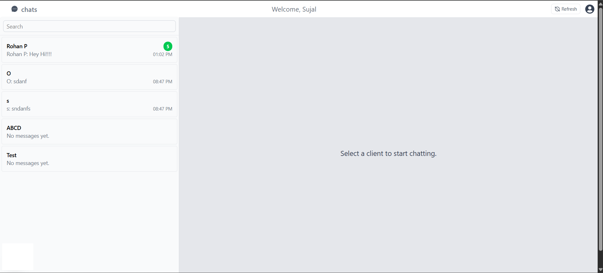
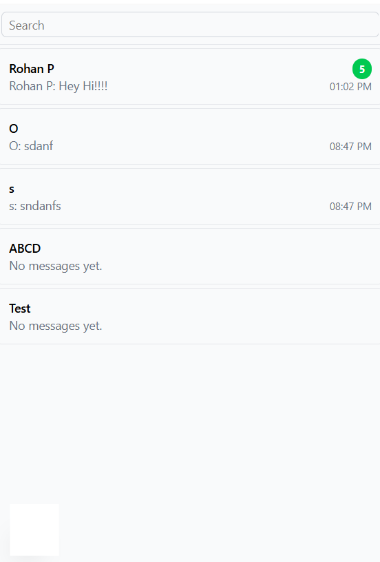
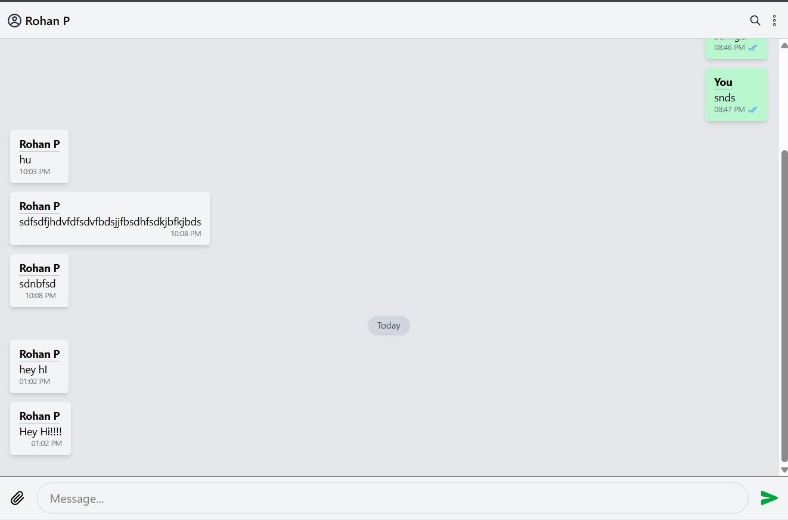
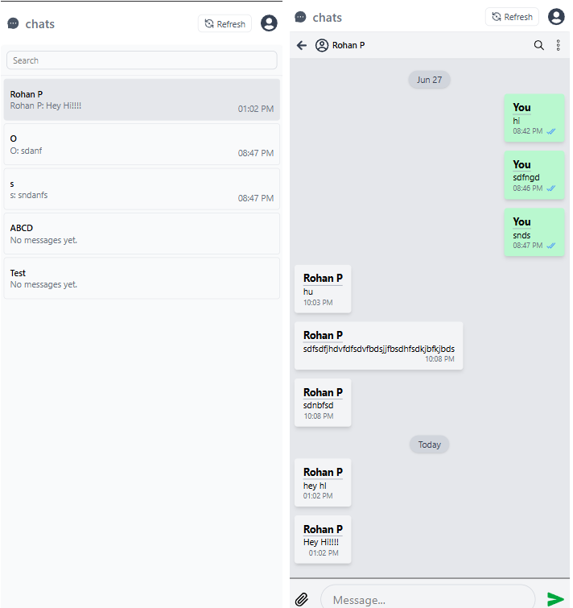
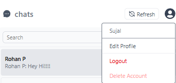
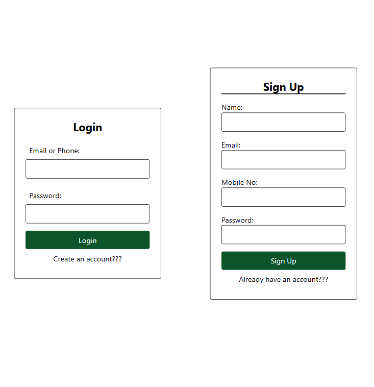
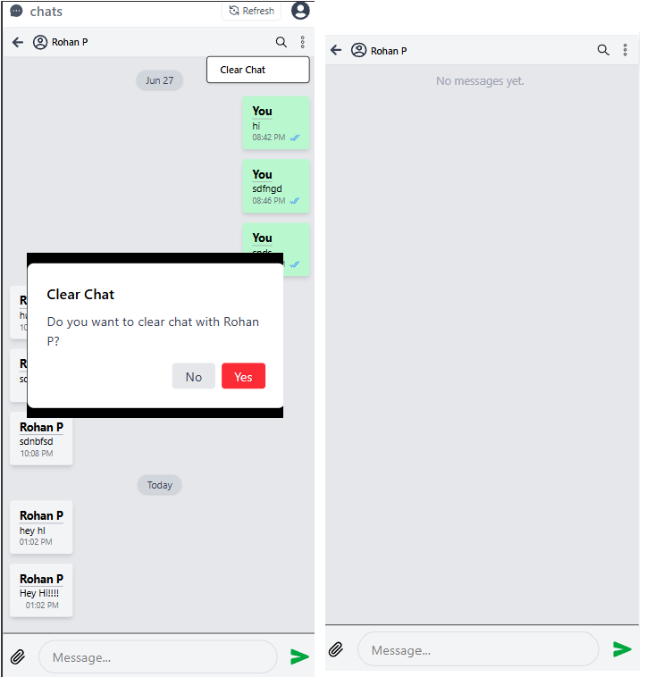

Live Link:- https://ro-chat-new.vercel.app/login


# Chat App:

Backend:- https://ro-chat-backend.onrender.com/


## Description

A modern, responsive real-time chat application built with React, Next.js, Node.js, and MongoDB. The app supports user authentication, real-time messaging, read receipts, chat management, and a clean, mobile-friendly UI inspired by popular messaging platforms.

---

## Features

- **User Authentication:** Sign up and log in with email (Gmail) or phone number.
- **Responsive Design:** Fully optimized for mobile, tablet, and desktop screens.
- **Real-Time Messaging:** Instantly send and receive messages with live updates.
- **Read Receipts:** See when your messages are read (single/double tick).
- **Unread Message Badges:** See how many unread messages you have per chat.
- **Profile Management:** Edit your profile, change password, and update mobile number.
- **Account Deletion:** Permanently delete your account and all associated chats.
- **Chat Management:** Clear chat history with any user.
- **User Menu:** Access profile, logout, and delete account from a convenient dropdown.
- **Toasts & Feedback:** User-friendly notifications for all major actions.
- **Animations:** Smooth transitions for messages, menus, and modals.

---

## Tools / Skills Used

- **Frontend:**
  - React.js (with functional components and hooks)
  - Next.js (App Router)
  - Tailwind CSS (for utility-first, responsive styling)
  - react-hot-toast (for notifications)
  - Framer Motion / Tailwind transitions (for animations)

- **Backend:**
  - Node.js & Express.js (REST API)
  - MongoDB & Mongoose (database and models)
  - Socket.IO (real-time communication)
  - JWT (authentication)
  - bcryptjs (password hashing)

- **Other:**
  - ESLint & Prettier (code quality and formatting)
  - Vercel/Netlify/Render (deployment-ready)

---

## Screenshots

### Home / Chat List


### Chat List with Conversations


### Chat Area with Messages


### Mobile Responsive View


### User Menu & Profile Options


### Login & Signup Pages


### Clear Chat Functionality


---

## Getting Started

1. **Clone the repository**
2. **Install dependencies**  
   ```bash
   npm install
   ```
3. **Set up environment variables**  
   - `NEXT_PUBLIC_API_URL` for frontend
   - `MONGODB_URI`, `JWT_SECRET` for backend
4. **Run the backend**  
   ```bash
   cd server
   npm start
   ```
5. **Run the frontend**  
   ```bash
   cd client
   npm run dev
   ```
6. **Open your browser at**  
   `http://localhost:3000`

---

## License

MIT

---
